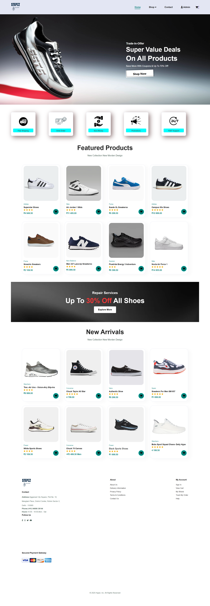
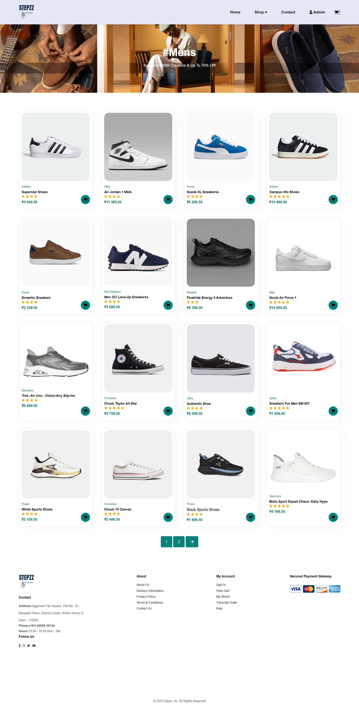
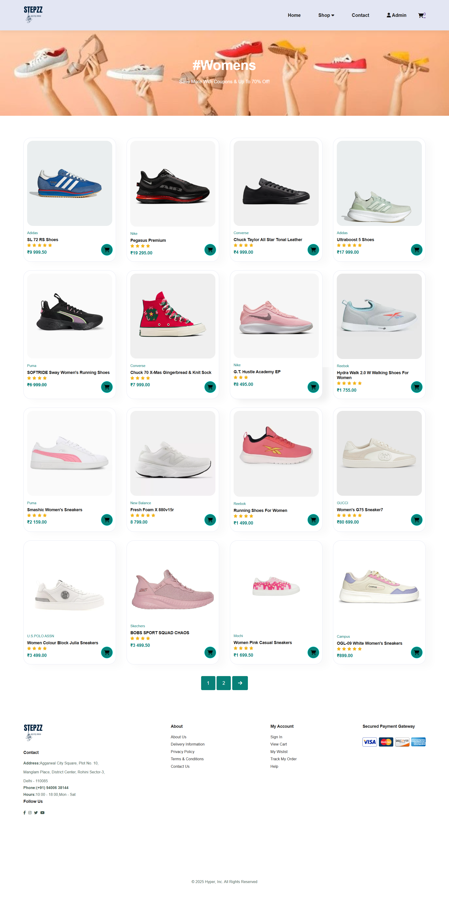
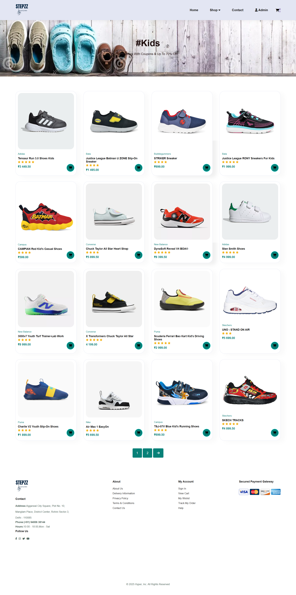
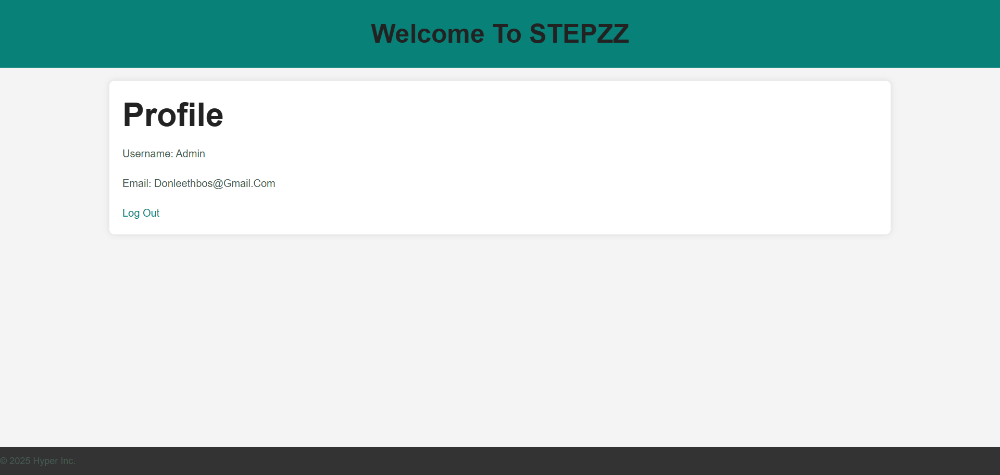
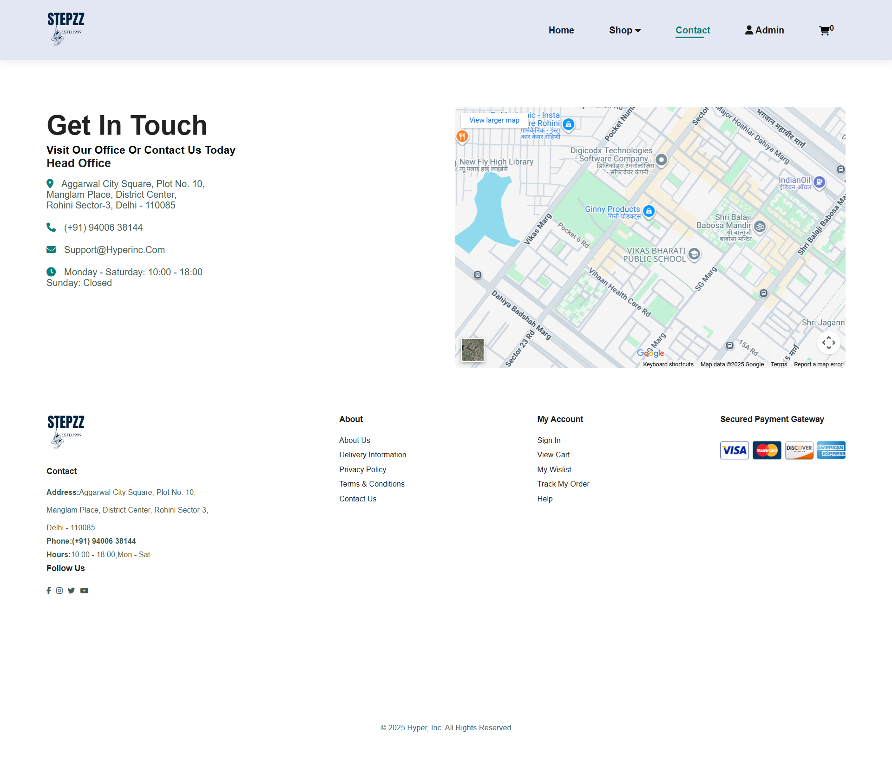
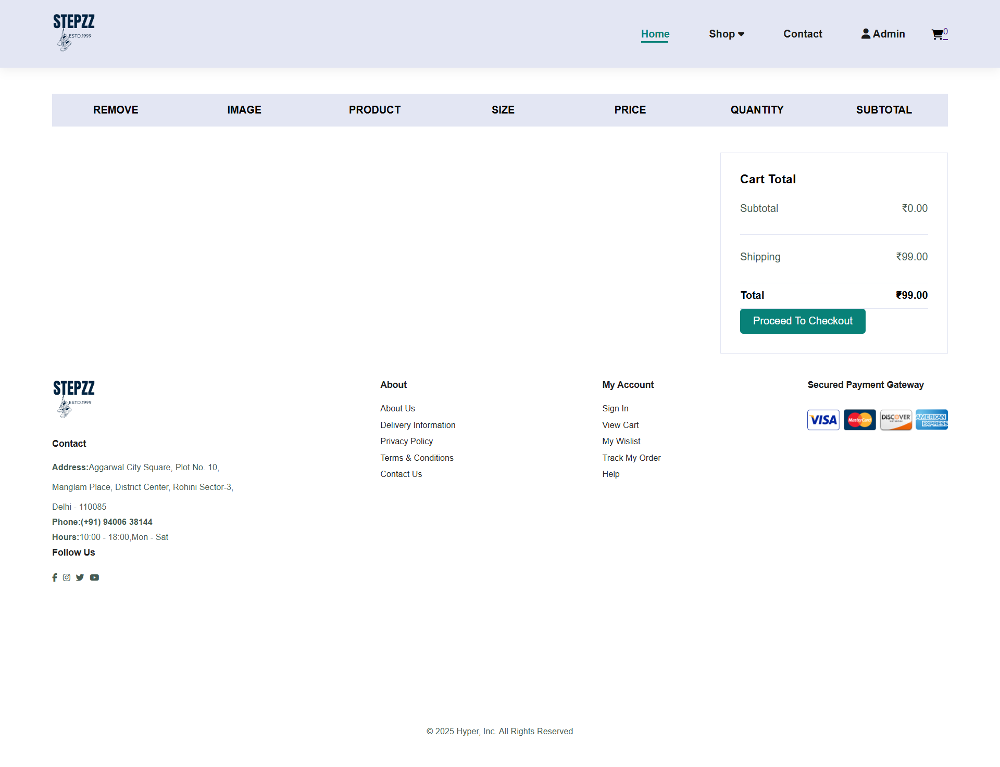

# STEPZZ - E-commerce Shoe Store

## Django-based E-commerce Platform

### Project Overview
This is a college minor project - a fully functional e-commerce website for selling shoes built with Django.

### Features
- User authentication (Login/Signup)
- Product catalog (Men, Women, Kids categories)
- Shopping cart functionality
- Payment integration
- Responsive design

### Tech Stack
- **Backend**: Django (Python)
- **Frontend**: HTML, CSS, JavaScript
- **Database**: SQLite3
- **Version Control**: Git/GitHub

### Installation
1. Clone the repository
2. Create virtual environment: `python -m venv venv`
3. Activate virtual environment:
   - Windows: `venv\Scripts\activate`
   - Mac/Linux: `source venv/bin/activate`
4. Install dependencies: `pip install -r requirements.txt`
5. Run migrations: `python manage.py migrate`
6. Create superuser: `python manage.py createsuperuser`
7. Run server: `python manage.py runserver`

### Project Structure
├── STEPZZ_app/ # Django app
├── static/ # Static files (CSS, JS, images)
├── templates/ # HTML templates
├── manage.py
├── requirements.txt
└── README.md

### Screenshots

Home Page

Mens Page

Womens Page

Kids Page

Profile Page

Contact Page

Cart Page

Cart Page with Product

### Developer
Abdurrahman Ibn Ebrahim
Government Polytechnic College Cherthala
Mail:abdurrahmanibnebrahim24@gmail.com
LinkedIn:www.linkedin.com/in/abdurrahman-ibn-ebrahim-aa7a132ab